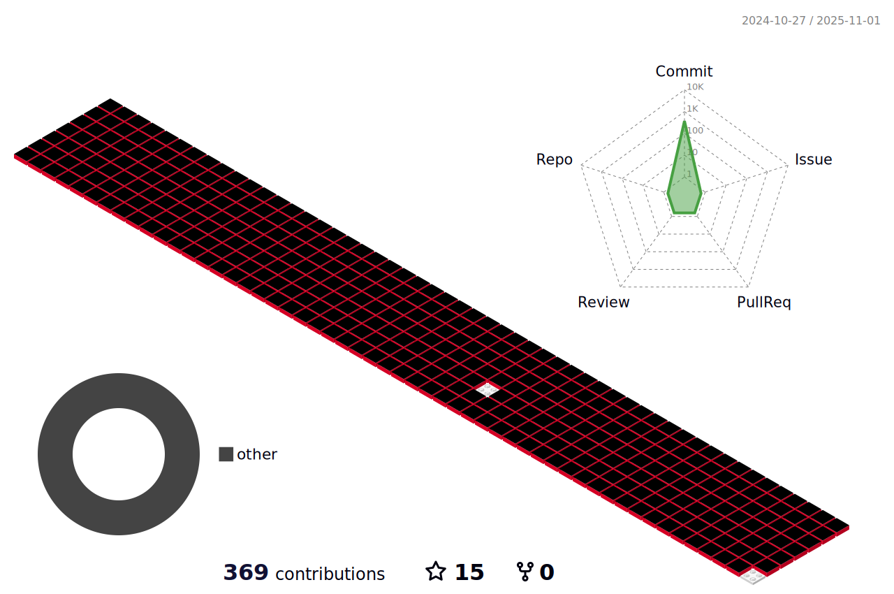

### My name is 👋:grin::point_down:

------

<h2>My Tech Stack</h2>

   
     
     
      

------
<h2>Most Used languages</h2>

  

<h2>Git Stats</h2>

**hacs2772/hacs2772** is a ✨ _special_ ✨ repository because its `README.md` (this file) appears on your GitHub profile.

 

------

<h2>BLOGS</h2>

GITHUB.IO : https://hacs2772.github.io/

NAVER : https://blog.naver.com/hacs2772

TSTORY : https://hacs2772.tistory.com/

:snowflake:

Here are some ideas to get you started:

- 🔭 I’m currently working on ...
- 🌱 I’m currently learning ...
- 👯 I’m lo
